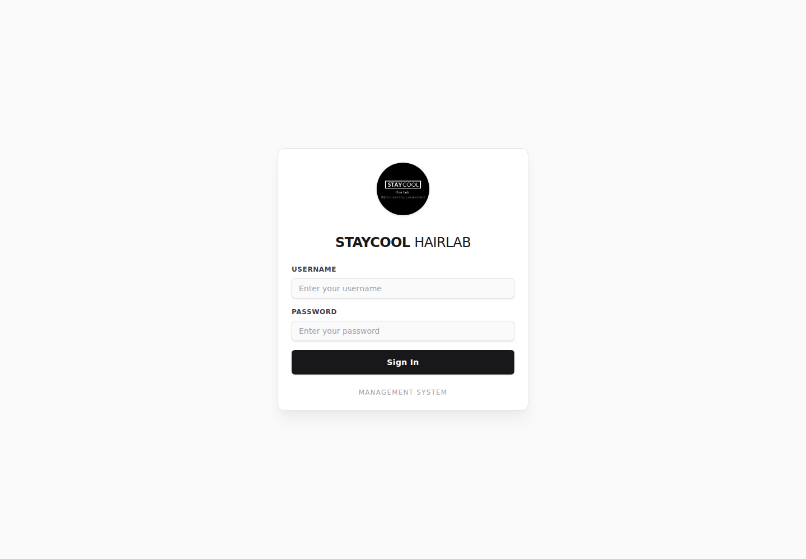
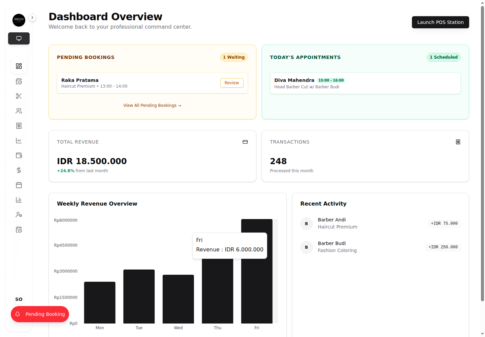
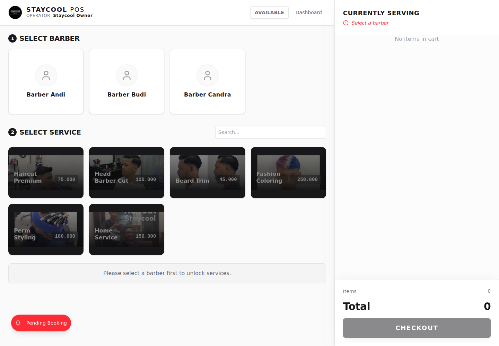
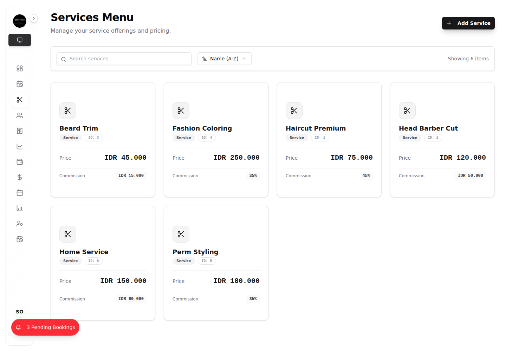
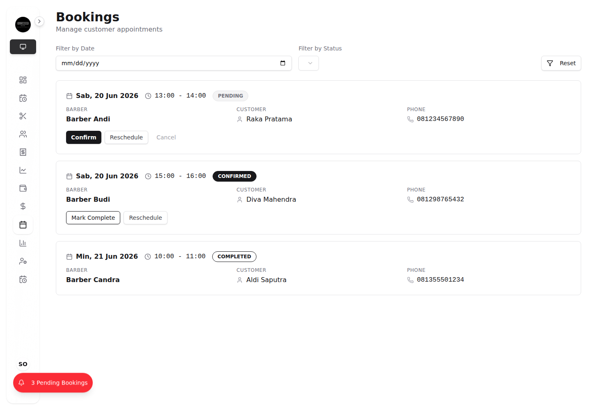
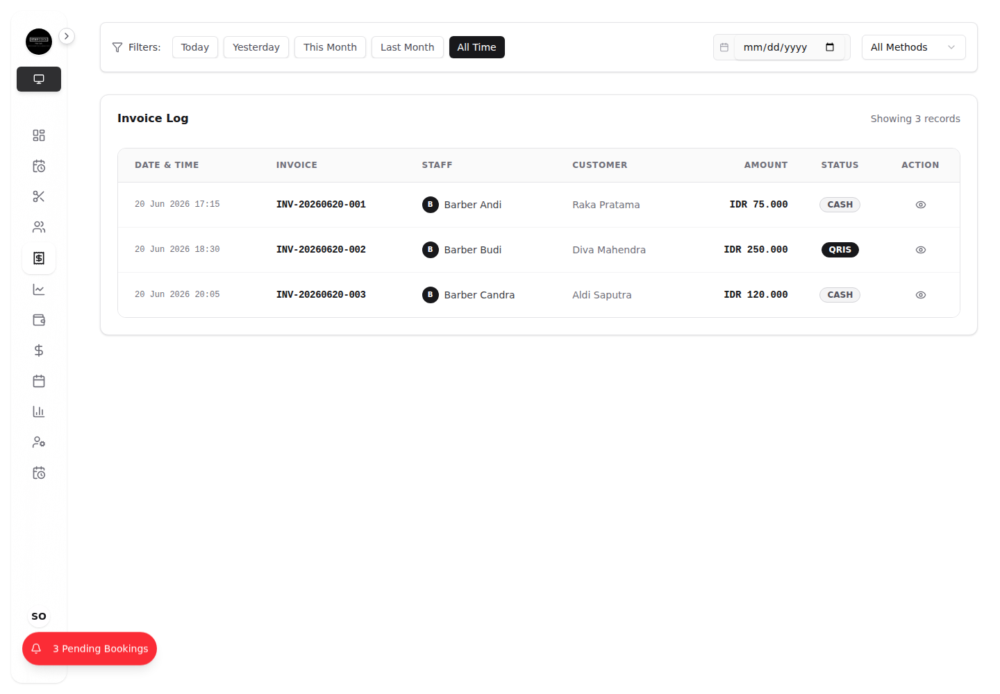
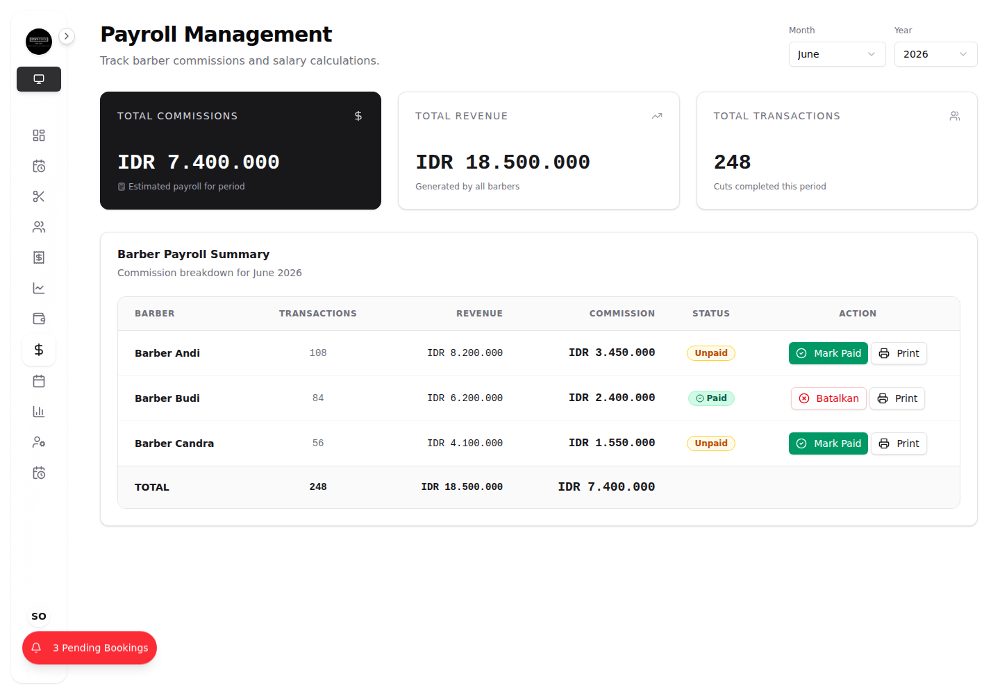
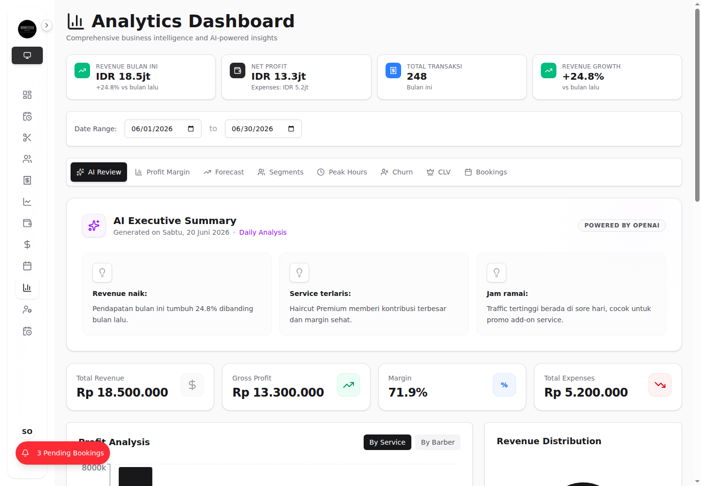
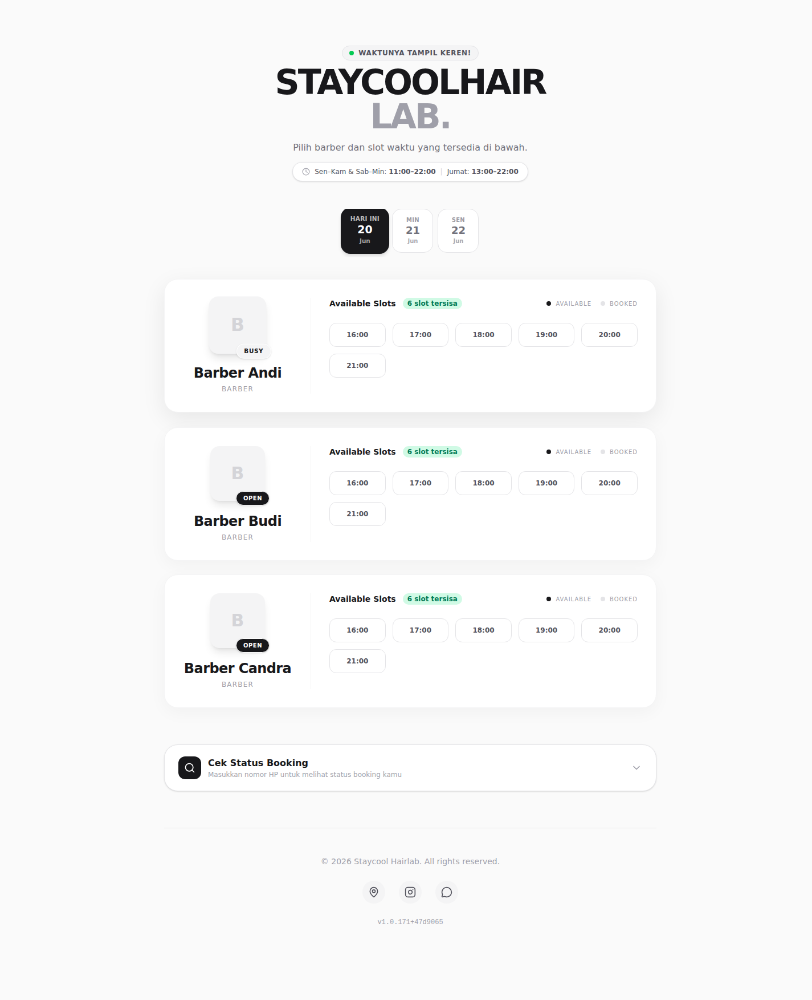

<section class="portfolio-case-study">
  <header>
    
Full-Stack POS & Business Management System

    <h1>Staycool POS</h1>
    

      Staycool POS is a full-stack point-of-sale and operations platform built for a modern barbershop business. It helps staff process daily transactions quickly while giving owners a clear dashboard for revenue, appointments, services, customers, expenses, payroll, and analytics.
    

  </header>

  <section>
    <h2>Overview</h2>
    

      The product combines a fast cashier workflow with owner-level business controls. Staff can run the POS station, select barbers and services, build a cart, and complete checkout. Owners can manage service pricing, monitor bookings, review transaction history, calculate barber commissions, and read business insights from one dashboard.
    

    

      The interface uses a clean monochrome visual direction with a premium barbershop feel. It is designed to work well for tablet-based cashier workflows and desktop management dashboards.
    

  </section>

  <section>
    <h2>Problem</h2>
    

      Many small barbershops still track sales, barber commissions, bookings, expenses, and daily reports manually. This makes reporting slow, creates room for calculation mistakes, and makes it difficult for the owner to understand business performance in real time.
    

  </section>

  <section>
    <h2>Solution</h2>
    

      Staycool POS centralizes the main barbershop workflows into one system: authentication, POS checkout, service management, booking management, transaction history, payroll, and analytics. The result is a more reliable workflow for staff and clearer business visibility for owners.
    

  </section>

  <section>
    <h2>Key Features</h2>
    <ul>
      <li><strong>Role-based authentication:</strong> Owner and staff access are separated using JWT authentication.</li>
      <li><strong>POS station:</strong> Staff can select barbers, choose services, manage cart items, and process checkout.</li>
      <li><strong>Owner dashboard:</strong> Revenue, transaction count, active barbers, booking summaries, and recent activity are shown in one place.</li>
      <li><strong>Service management:</strong> Owners can manage service names, prices, commission types, and commission values.</li>
      <li><strong>Booking management:</strong> Appointments can be reviewed by date, status, customer, barber, and time slot.</li>
      <li><strong>Transaction history:</strong> Invoices are searchable and include customer, staff, amount, payment method, and transaction details.</li>
      <li><strong>Payroll management:</strong> Barber commissions and estimated payroll are calculated from real transaction data.</li>
      <li><strong>Business analytics:</strong> Revenue, profit, peak hours, and AI-style executive summaries help owners make better decisions.</li>
    </ul>
  </section>

  <section>
    <h2>Tech Stack</h2>
    <ul>
      <li><strong>Frontend:</strong> React 19, Vite, TypeScript, Tailwind CSS, Radix UI, SWR, Zustand</li>
      <li><strong>Backend:</strong> Express, Prisma, MySQL, JWT, bcrypt</li>
      <li><strong>Tooling:</strong> Playwright for portfolio screenshots, ESLint, Docker frontend deployment</li>
    </ul>
  </section>

  <section>
    <h2>Demo Data</h2>
    

      The screenshots below were captured with Playwright using dummy data from <code>.env.doc</code> and mocked API responses, so the portfolio gallery can be generated without a local production database.
    

    <pre><code>Owner username: owner
Owner password: 123456
Staff username: andi
Staff password: 123456
Edit PIN: 1234</code></pre>
  </section>

  <section>
    <h2>Gallery</h2>
    

      This gallery presents the complete product story: login, owner dashboard, cashier workflow, service catalog, booking operations, transaction reporting, payroll, analytics, and public customer-facing status.
    

    <figure>
      
      <figcaption>
        <strong>Login Screen.</strong> Branded authentication screen for owner and staff access.
      </figcaption>
    </figure>

    <figure>
      
      <figcaption>
        <strong>Owner Dashboard Overview.</strong> Revenue, growth, transactions, active barbers, pending bookings, appointments, charts, and recent activity.
      </figcaption>
    </figure>

    <figure>
      
      <figcaption>
        <strong>POS Station.</strong> Fast cashier workflow for selecting barbers, choosing services, managing cart items, and preparing checkout.
      </figcaption>
    </figure>

    <figure>
      
      <figcaption>
        <strong>Service Management.</strong> Owners can manage service pricing, commission type, and commission value for each service.
      </figcaption>
    </figure>

    <figure>
      
      <figcaption>
        <strong>Booking Management.</strong> Appointment list with customer, phone number, barber, date, time slot, and booking status.
      </figcaption>
    </figure>

    <figure>
      
      <figcaption>
        <strong>Transaction History.</strong> Invoice log showing staff, customer, amount, payment method, and transaction records.
      </figcaption>
    </figure>

    <figure>
      
      <figcaption>
        <strong>Payroll Management.</strong> Commission and payroll overview based on barber revenue and completed transactions.
      </figcaption>
    </figure>

    <figure>
      
      <figcaption>
        <strong>Business Analytics.</strong> KPI cards, AI executive summary, profit margin, and peak-hour analysis for the owner.
      </figcaption>
    </figure>

    <figure>
      
      <figcaption>
        <strong>Public Booking Status.</strong> Customer-facing side of the product for booking and status visibility.
      </figcaption>
    </figure>
  </section>

  <section>
    <h2>Portfolio Summary</h2>
    <blockquote>
      I built Staycool POS, a full-stack barbershop management system that combines fast checkout, booking management, role-based authentication, payroll calculation, and owner-level business analytics. The app helps staff process daily transactions while giving owners clear visibility into revenue, appointments, services, customers, expenses, commissions, and operational performance.
    </blockquote>
  </section>

  <section>
    <h2>Screenshot Workflow</h2>
    
Playwright is installed at the project root and was used to generate the portfolio gallery.

    <pre><code>npm install --save-dev @playwright/test
npx playwright install chromium
npx playwright install chrome</code></pre>
  </section>
</section>
